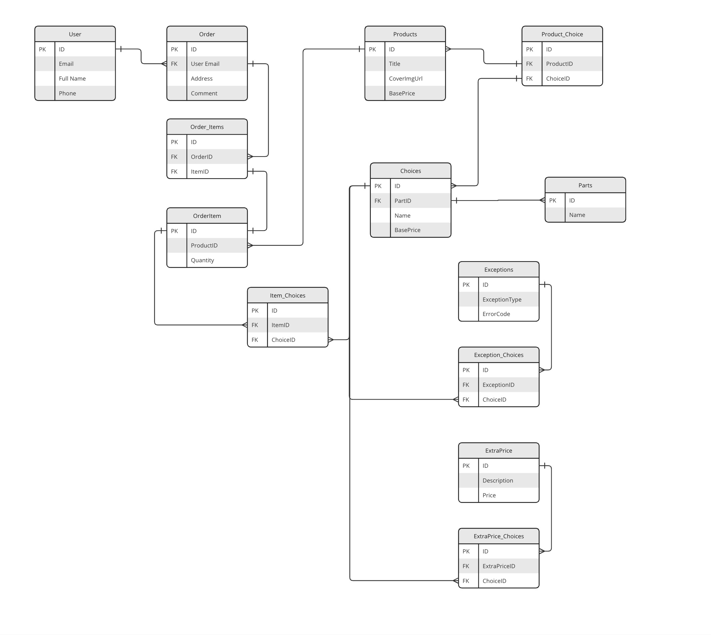

# Marcus Bikes

The repo provides a basic implementation of the domain model of the order in a bike shop. It deliberately does not include a storage and API layer to keep things as pure as possible.

The implementation of the domain logic is influenced by Domain-Driven Design. In this approach, the domain business logic is the core of the app. This approach is also known as the ImPureIm sandwich, where any side effects, such as interacting with the DB or returning a response to the API, are moved to the edges of the module.

The assumptions made:
- we have only one type of user - guest user

## Data Model

[Data Model in Miro](https://miro.com/app/board/uXjVK2tcVuc=/?share_link_id=448927819943)

## Website User Journey

### The Product Page

The most important factor for the e-commerce websites is the speed. It is crucial to display the product page quickly. In terms of the frontend this means that a high LCP metric is key. Therefore, the initial page must be slim. The best solution here is to rely on server-side rendered pages and server cache to respond quickly.

To achieve this, I'd postpone loading non-critical styles and JS for secondary actions. Not every visitor comes to the product page to buy a bike, I consider it critical, but secondary in the context of initial loading. This means that the selectors for possible parts combinations must be loaded asynchronously, with a lower priority.

The bike parts selection can be organised as a wizard, from core parts (frame) to optional parts. At each step, we make an API call to find out what options are available to select next.

Optionally, we can calculate the price at each step, showing the price increment for each option (see Apple Macbook customisation flow). This requires an extra endpoint that calculates the price based on an unfinished order.

### The "Add to Cart" Action

There are many possible approaches when the user clicks the "Add to Cart" button.

In the situation of a small shop, I prefer the basic approach is to store the cart locally (keeping in mind that we only have guest users). In case we want to send notifications nudging the customer to complete the purchase, we can make an API call and persist the user email and the date of the action to be able to act on them later.

This approach also keeps the system extensible. If at some point we decide we want to store the cart on the server, we can extend the basic endpoint.

## Website Administrator Journey

### Create New Product

To create a new product, the administrator must provide the following information:
- Name
- Product description
- Images
- Customisation parts and their corresponding options
- Base price

This operation is one of the core operations in the shop, so it affects a large number of database tables:
- creates a new record in the product table
- if necessary, creates new records for the customization parts
- if necessary, creates choices for the customization parts. Then creates relationships between the choices and corresponding parts, choices and products
- sets price for each customization part and combinations
- sets incompatible choices

Other operations on the product are a subset of the work required to create a new product.

### Add a New Part Choice

From the UI perspective: The new part choice can be added from the product page assuming that this is the most common use case. The administrator opens an edit product page where they can see all the parts and choices available for the product.

By clicking a button the administrator can open a form to enter the name of the new choice and the price. When saved, this choice will only be available for the current product.

From a database point of view, we will create a new record in the choices table and then a record to the product-choices table where we store what choices are available for each product.

### Setting Up Prices

The total price of a bike is the sum of the following:
- base bicycle price
- price of each choice
- extra price for the combination of choices

The pricing UI should be integrated into the product creation/edit form. If the base price and choice prices can be set trivially via a set of input fields, the combination pricing requires a constructor to bind multiple choices into a pricable set.

In the proposed data model, the prices are split between three tables:
- the base bicycle price is stored in the Product table
- the choice price is stored in the Choice table
- the extra price for a combination is stored in a separate ExtraPrice table

The advantage of this approach is that we can gradually calculate the price as the user progresses through the shopping experience and show detailed information.

